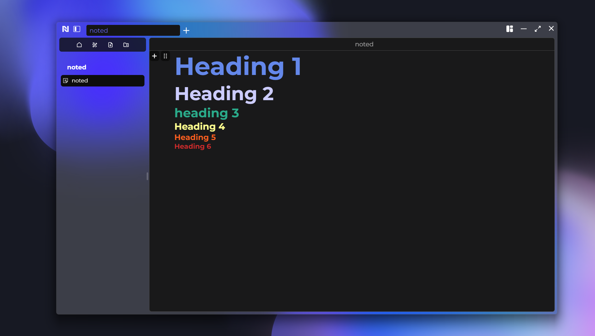
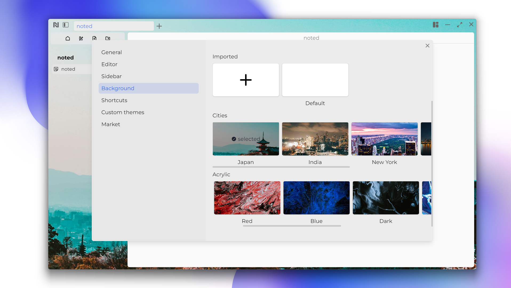
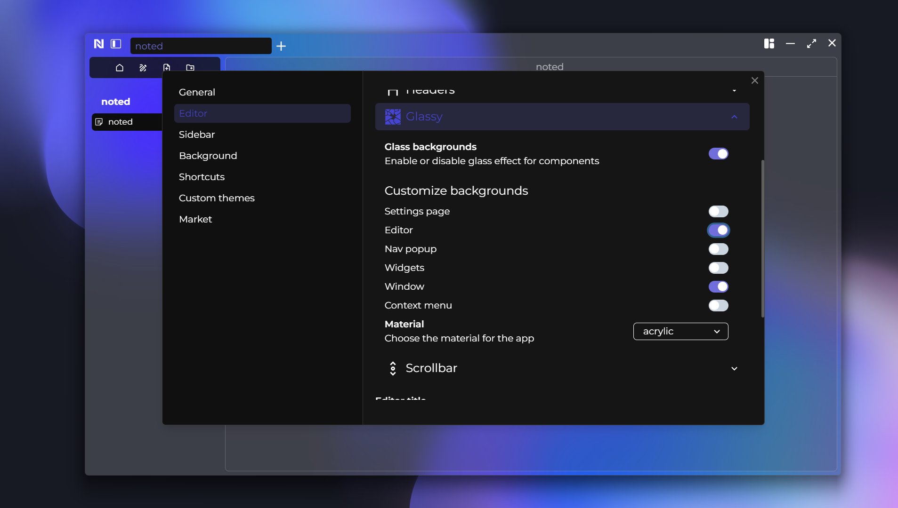

# Noted

  
  
  

Noted is a desktop application where you can write block styled notes. It is inspired by [Notion](https://www.notion.so/), [Obsidian](https://obsidian.md/) and [Arc](https://arc.net/).

To setup the full application follow the steps for each service.

Functionalities:

- Blocks
  - Paragraph
  - Heading
  - Checklist
  - List
  - Quote
  - Codeblock
  - Delimiter
  - Table
  - ...
- Themes
- Colored Headers
- Glass Application
- Fonts
- Widgets
- Shortcuts
- ...

To see the full list you can read the [Documentation](https://write-noted.vercel.app/docs).

