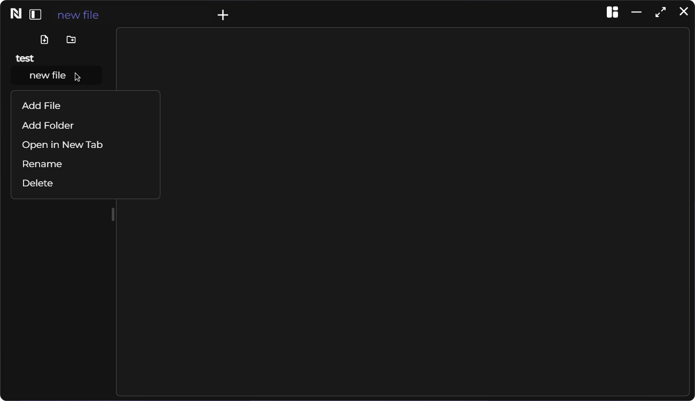
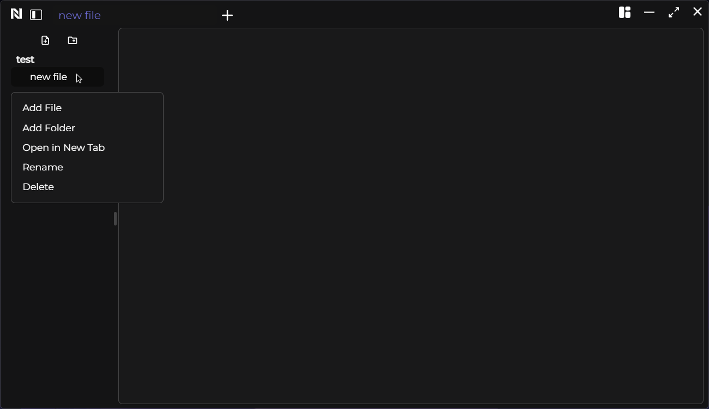

# Creating a Noted Workspace

To initiate a Noted workspace, simply follow these steps:

- Create a new folder
- Drag and drop or open it in the application

And just like that, your Noted workspace is ready to go! It's as easy as creating a folder and opening it in the application.

&nbsp;

## Creating a Noted file/folder

### Use the action menu

&nbsp;

### Right click a folder/file

