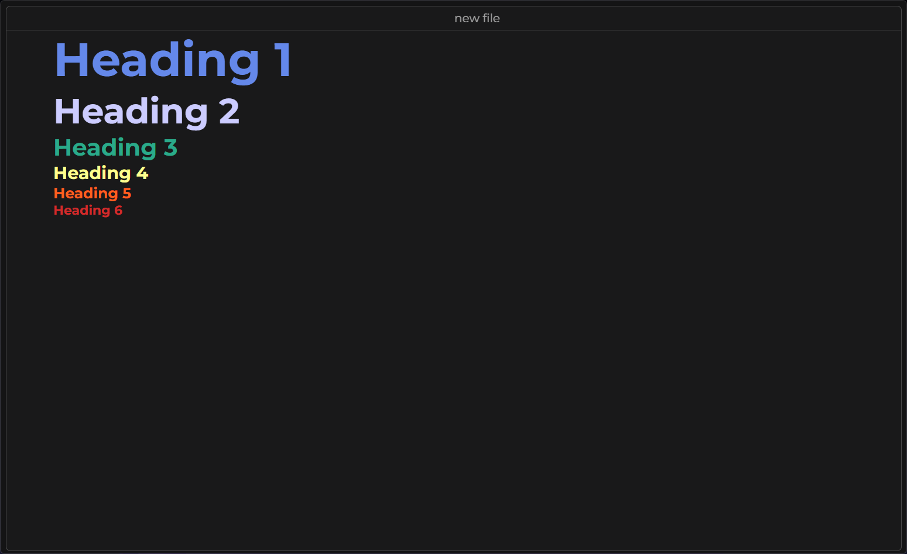
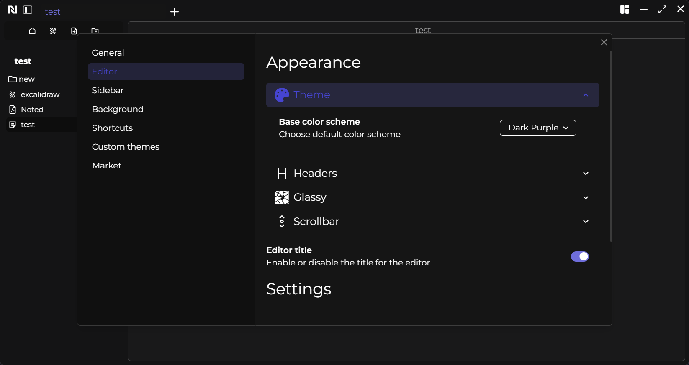
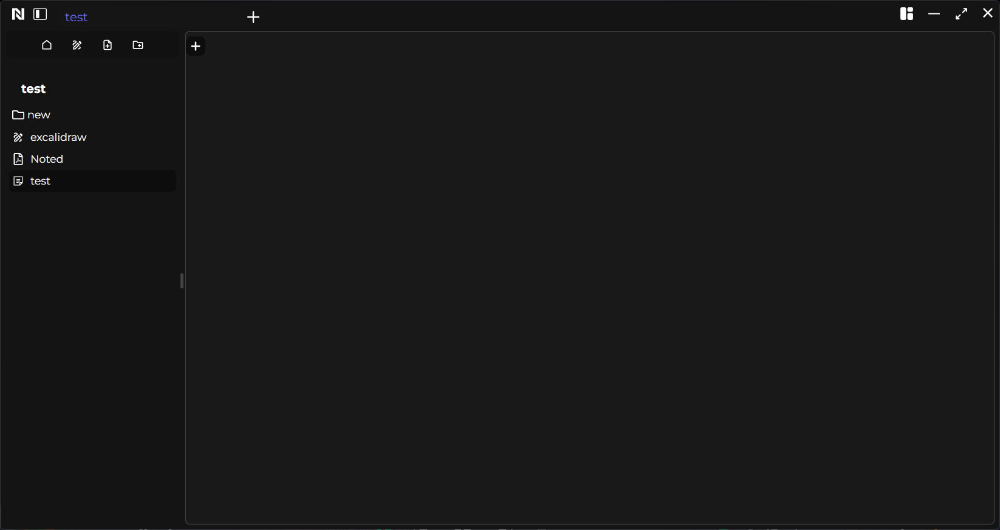
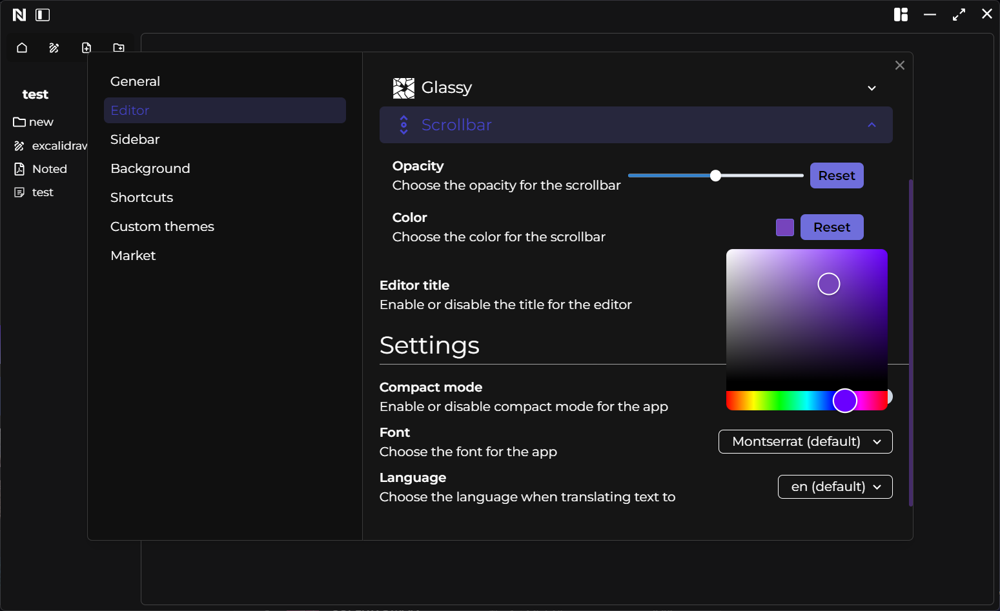

# Compact Mode

When Compact Mode is enabled, the navigation bar aligns with your editor, providing a more immersive full-screen experience when collapsing the sidebar.

&nbsp;

# Font

You can change the font used by your workspace.

# Editor title

You show or hide the editor title.

# Scrollbar

You can change the look of the scrollbar.

