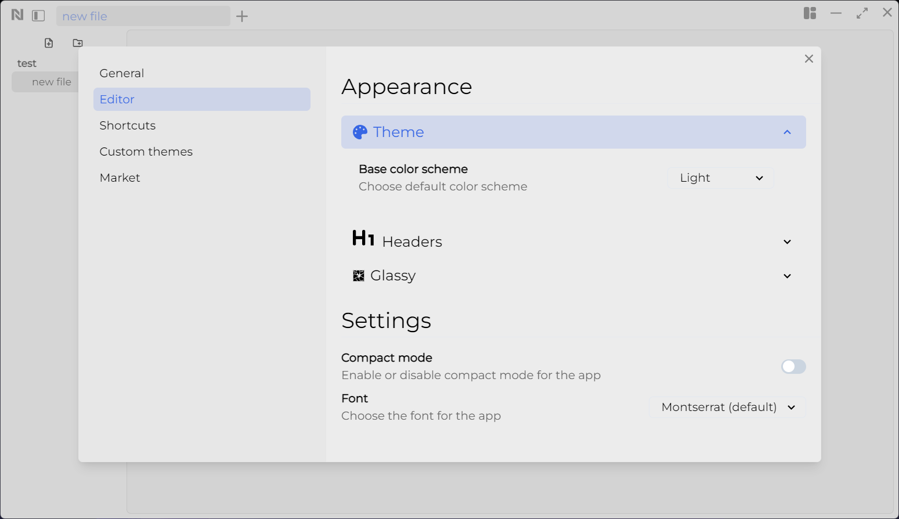
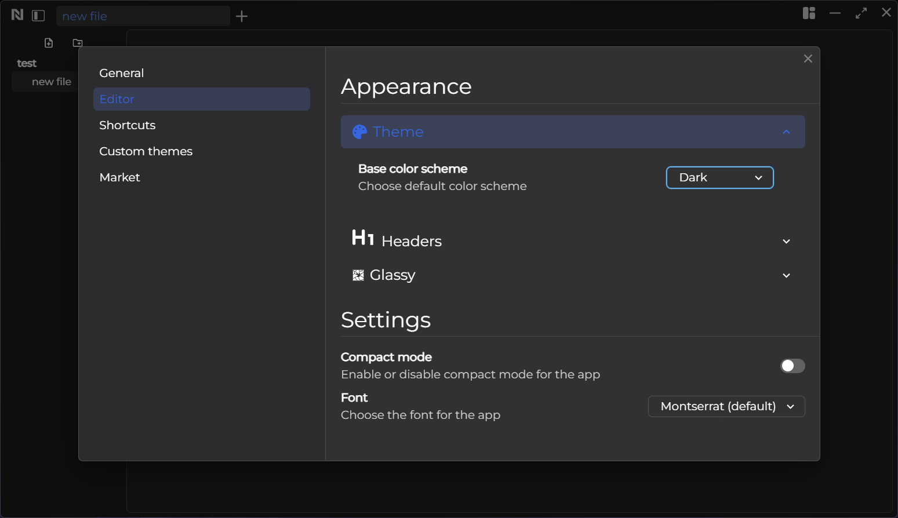
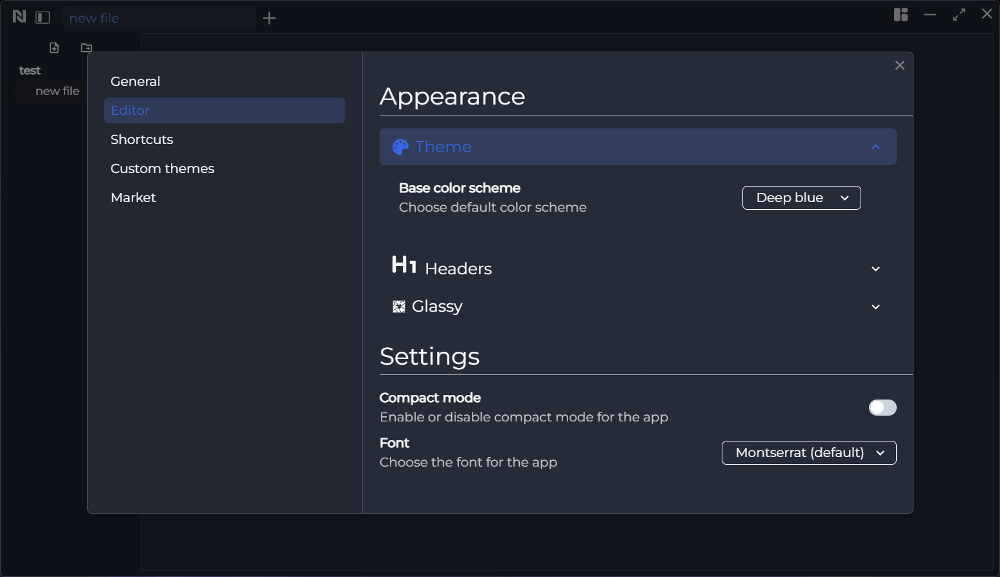
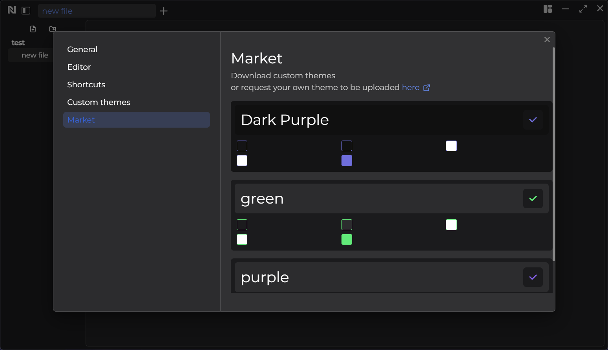

### Light

&nbsp;

### Dark

&nbsp;

### Deep Blue

&nbsp;

### Custom

&nbsp;

## Market

In the market, you can add themes created by the community to your workspace.

&nbsp;

## Create a Custom theme

You have the ability to design a custom theme directly within the application, which will be saved to your workspace. Additionally, you can create and submit a theme on the [Noted site](https://write-noted.vercel.app/), allowing the community to use it.
