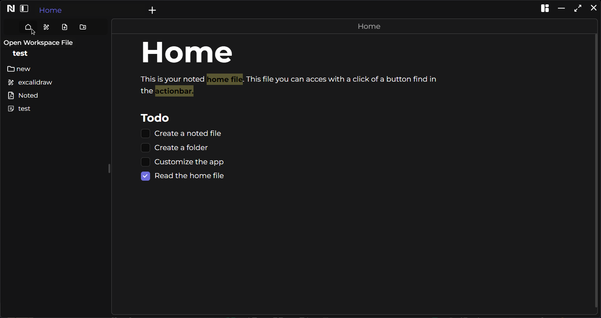
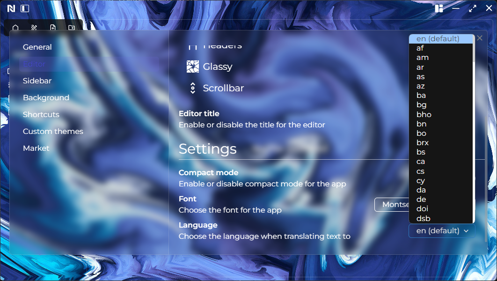

# Types of blocks

Noted employs block styling within its editor, empowering users to effortlessly create various text formats and styles.

- Paragraph
- Heading
- Checklist
- List
- Quote
- Codeblock
- Delimiter
- Table
- Text marker
- Nestes checklist
- LaTex
- Audio player

&nbsp;

## Codeblock

Suported languages are:

- Apache
- Bash
- C#
- C++
- CSS
- CoffeeScript
- Diff
- Go
- HTML, XML
- HTTP
- JSON
- Java
- JavaScript
- Kotlin
- Less
- Lua
- MakeFile
- Markdown
- Nginx
- Objective-C
- PHP
- Perl
- Properties
- Python
- Ruby
- Rust
- SCSS
- SQL
- Shell Session
- Swift
- TOML, also INI
- TypeScript
- YAML
- Plaintext

&nbsp;

## Heading

Suported headers are:

- Heading 1
- Heading 2
- Heading 3
- Heading 4
- Heading 5
- Heading 6

# Noted home file

Each workspace has a default Noted home file. You can access this file easily with a click of a button.

# Noted actions

In a Noted file you can perform an action by typing "\\". Here you can rewrite or translate a given text.

You can choose the language the text gets translated to in the settings page.

